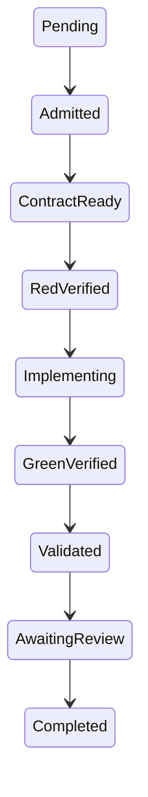

# Arquitectura inicial de la ensambladora

Fecha: 2026-10-06  
Estado: decisiones iniciales propuestas; aceptación humana pendiente.

## Límites y contratos

El núcleo representa configuraciones y transiciones de entrega de software. No representa entidades de comercio, logística ni otro negocio. Los repositorios objetivo son identificadores lógicos en esta etapa; no existe acceso remoto autorizado.

| Componente | Entrada | Salida | Estado |
|---|---|---|---|
| Validador | Tipo de documento y objeto JSON. | Conformidad con el esquema o error. | Implementado. |
| Resolutor | Aplicación, colecciones explícitas y verificador de aprobación. | Versiones, digests, contextos y IDs de reglas aplicables. | Implementado; aprobación verificada obligatoria. |
| Planificador técnico | Perfil validado y selección de E2E. | Herramientas fijadas y etapas ordenadas con evidencia y límites declarados. | Implementado; no ejecuta comandos. |
| Transiciones | Estado origen y destino. | Destino permitido o rechazo. | Implementado, solo estructura. |
| Orquestación durable | Solicitud de ejecución y eventos validados. | Ejecución persistida y actividades coordinadas. | Pendiente. |
| Runner | Trabajo autorizado con comandos, límites y entradas. | Resultados de herramientas y evidencia. | Pendiente. |
| Registro aprobado | Paquete, firma y autoridades públicas configuradas por dominio. | Publicación sin sobrescritura, verificación y lectura por pin. | Implementación local; operación con identidades reales pendiente. |

## Decisiones iniciales

### D-001. Núcleo independiente

Usar una biblioteca .NET 10 sin dependencias de ejecución del material consultado. Los esquemas se validan mediante una biblioteca de JSON Schema, no mediante un parser de validación hecho a medida.

La solución incluye exclusivamente el núcleo y sus pruebas. Los fixtures se copian desde cinco directorios explícitos; no hay exploración del workspace ni consulta del material de referencia.

### D-002. Configuración explícita

Usar JSON como formato ejecutable inicial y JSON Schema 2020-12 como contrato. Los ejemplos YAML de la propuesta son ilustrativos; la implementación actual no ofrece un lector YAML.

Cada selección exige ID y versión exacta. Se rechazan referencias ausentes o ambiguas. El dominio debe declarar estado aprobado y responsable de aprobación, pero estas declaraciones no bastan: el resolutor exige un verificador que compruebe su publicación firmada en el registro.

Los documentos no admiten propiedades desconocidas. El esquema inicial requiere al menos un contexto, término, fuente y regla de negocio. Ampliaciones del contrato deberán versionarse; no se asumirá que cualquier negocio real ya puede representarse sin extensiones.

El contrato técnico ejecutable usa `schemaVersion: 1.1` y perfil `2.0.2`. Los perfiles anteriores se conservan sin sobrescritura. El descriptivo puede validarse para lectura histórica, pero no se admite al resolver nuevas aplicaciones. Los demás tipos de configuración mantienen sus versiones actuales.

### D-003. Pins reproducibles

Calcular SHA-256 sobre JSON normalizado: claves de objetos ordenadas ordinalmente, orden de arrays preservado y serialización UTF-8 de .NET. Se fijan aplicación, dominio, perfil y política.

Es una convención propia, no una implementación de canonicalización universal. El registro local publica mediante creación exclusiva del archivo y no permite reemplazar una versión desde su API. Revalida firma y digest en cada lectura y admite comprobar un pin esperado. Fijar un digest permite detectar cambios, no impide editar archivos desde fuera del proceso; la protección física depende de permisos de almacenamiento. La reanudación del orquestador sigue pendiente.

### D-004. Orquestación y ejecución separadas

Mantener como dirección propuesta Azure Durable Functions para el control y runners aislados para ejecutar código generado. La biblioteca actual no incluye el SDK cloud, no crea recursos y no ejecuta comandos de los perfiles.

La persistencia de ejecución será responsabilidad del adaptador durable. La evidencia deberá almacenarse fuera del alcance de escritura del implementador y referenciarse por digest. El backend concreto y la retención requieren una decisión operativa posterior.

### D-005. Identidades y permisos

Usar identidades de carga de trabajo y permisos mínimos para cloud y repositorios cuando se autoricen integraciones. Ningún token o secreto se incluirá en el modelo de configuración, en los ejemplos o en el contexto del agente.

El alta de una integración requerirá definir alcance, identidad, permisos y responsable. En este incremento no hay integraciones externas autenticadas.

### D-006. Aprobación criptográfica por dominio

Verificar firmas RSA-PSS con SHA-256 y claves de al menos 2048 bits mediante la biblioteca criptográfica de .NET. La declaración firmada incluye propósito del protocolo, dominio, versión, digest y aprobador.

Las autoridades autorizadas se inyectan desde configuración de confianza, no se toman del paquete. El registro comprueba su alcance por dominio y su firma, y el resolutor sin verificador no admite aplicaciones. La validación de esquema por separado permanece disponible para elaborar borradores.

El registro conserva paquete y aprobación en archivos independientes por referencia, sin claves privadas. Su API no sobrescribe versiones; una publicación parcial o corrupta falla al leer. La identidad humana detrás de la clave, la operación de firma y los permisos del directorio no se provisionan automáticamente. El protocolo y sus límites se detallan en [Registro de dominios](registro-dominios.md).

### D-007. Perfil técnico versionado y planificación previa

Separar el perfil tecnológico del dominio y declarar herramientas con versiones exactas, estructura de repositorio, argumentos de comandos, directorios de trabajo, dependencias y ubicaciones de evidencia.

El planificador exige restauración, build y pruebas de backend, y restauración, lint, build y pruebas de frontend. Las dependencias deben asegurar ese orden. E2E se incluye solo cuando se solicita, y requiere preparación de navegador y pruebas previas de ambos componentes. Ningún plan ejecuta comandos a través de shell.

El preflight compara un mapa de versiones observadas contra las versiones fijadas; no descubre ni instala herramientas. Los comandos reales, políticas de red, permisos, symlinks, consumo de recursos y autenticidad de las observaciones serán responsabilidad del runner. Véase [Perfil técnico](perfil-tecnico.md).

## Máquina de estados

Todo estado no terminal permite bloqueo o cancelación. `Completed`, `Blocked` y `Cancelled` son terminales en este primer contrato. No se admiten saltos ni auto-transiciones.

Las transiciones comprueban únicamente el orden. No verifican todavía que exista evidencia RED, gates conformes o aprobación humana: esos predicados pertenecen al orquestador de fase 2. La aprobación humana deberá asociarse a la versión exacta del cambio.

Los reintentos de implementación serán actividades dentro de `Implementing`, no saltos de estado. La refactorización requerirá revalidación antes de entregar. La recuperación de estados bloqueados se definirá en la fase operativa, sin inventar una transición de reanudación aquí.

## Catálogo inicial de bloqueos

| Código | Significado |
|---|---|
| `SCHEMA_INVALID` | Documento que no cumple el contrato estructural. |
| `REFERENCE_UNRESOLVED` | ID o versión ausente, o selección ambigua. |
| `DOMAIN_NOT_APPROVED` | Dominio seleccionado declarado como borrador. |
| `CONTEXT_NOT_FOUND` | Contexto de aplicación no definido en el dominio. |
| `DUPLICATE_IDENTIFIER` | Fuentes o reglas con IDs duplicados. |
| `RULE_REFERENCE_INVALID` | Regla con contexto o fuente inexistentes. |
| `DOMAIN_APPROVAL_REQUIRED` | Resolución sin verificador de aprobación configurado. |
| `DOMAIN_NOT_REGISTERED` | Paquete no publicado en el registro seleccionado. |
| `DOMAIN_APPROVER_UNAUTHORIZED` | Aprobador no autorizado para el dominio. |
| `DOMAIN_SIGNATURE_INVALID` | Firma inválida o clave no compatible con el protocolo. |
| `DOMAIN_APPROVAL_MISMATCH` | Metadatos o contenido diferentes de la declaración firmada. |
| `DOMAIN_CONTENT_CHANGED` | Documento de entrada distinto del paquete publicado. |
| `DOMAIN_PIN_MISMATCH` | Lectura distinta del digest esperado. |
| `DOMAIN_REGISTRY_INVALID` | Publicación corrupta, incompleta o con referencia equivocada. |

Un intento de sobrescribir una versión produce `IOException` por creación exclusiva. No se convierte una sobrescritura fallida en una aprobación nueva.

Los bloqueos del perfil distinguen versión histórica no ejecutable, rutas inválidas, etapas ausentes, dependencias desconocidas o cíclicas, evidencia ausente y herramientas ausentes o con versión incorrecta. Su catálogo se encuentra en [Perfil técnico](perfil-tecnico.md).

Los resultados de gate distinguen `passed`, `failed`, `not-applicable` y `not-executed`. El esquema exige evidencia para un resultado aprobado y razón para los demás. El evaluador que decide si se puede entregar una aplicación según esos resultados está pendiente.

## Seguimiento de fase 1

- [x] Estructura .NET independiente y pruebas de transiciones.
- [x] Esquemas iniciales para aplicación, dominio, perfil, política y gates.
- [x] Resolución de referencias y digests con ejemplos de dos negocios.
- [x] Definición de CI para build, pruebas y auditoría de dependencias.
- [x] Workflow GitHub Actions y controles CI verificados localmente.
- [x] Publicación y primera ejecución alojada de Motor CI aprobada.
- [x] Protección de main aplicada y verificada por API: PR y Motor CI obligatorios; sin force push ni borrado, incluso para administradores.
- [x] Registro local con firmas autorizadas por dominio, publicación exclusiva y verificación de pins.
- [x] Contrato backend/frontend, perfil versionado, planificación y comparación de versiones observadas.
- [x] Smoke test real en Windows con Node/pnpm/Chromium portables y evidencia backend/frontend.
- [x] Plantilla portable, lockfile y materialización de smoke frontend; validación local completa sobre copia nueva.
- [ ] Aceptación humana de decisiones y responsables de dominio reales.
- [ ] Configurar autoridades reales, proteger almacenamiento y operar el flujo humano de aprobación y firma.
- [x] Publicar una versión corregida del perfil y repetir la auditoría frontend: cero vulnerabilidades conocidas reportadas en la versión actual.
- [ ] Implementar validación en un runner aislado y autorizar herramientas y adaptadores.
- [x] Comprobar con un PR negativo que Motor CI impide completar un merge fallido: [PR #3](https://github.com/hon021/software-assembly/pull/3) falló en Motor CI y GitHub lo marcó como bloqueado; el resultado se registró en el [PR #4](https://github.com/hon021/software-assembly/pull/4), integrado en `7349346`.
- [x] Publicar por PR el smoke reproducible y observar su job alojado y check agregado: PR #1 integrado en main; 6 checks aprobados.

La fase permanece en curso. El smoke test verifica compatibilidad técnica, no reglas de negocio ni los pilotos completos hasta PR previstos para la fase 2. Véase [Validación local](validacion-local-perfil.md). El repositorio GitHub, Motor CI, el smoke reproducible y la protección de main están activos; la aceptación operativa sigue pendiente. Las decisiones y evidencia necesarias para cerrar se enumeran en [Cierre de fase 1](cierre-fase-1.md).