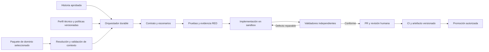

# Propuesta: ensambladora de software dirigida por contratos

Fecha: 2026-10-06  
Estado: propuesta para evaluación  
Referencia metodológica: proyectos del directorio `Base`, no dependencias del nuevo producto.

## Resumen ejecutivo

Se recomienda construir una **ensambladora de software dirigida por contratos y verificada por pruebas**, independiente de cualquier negocio. Los proyectos de `Base` se utilizarán exclusivamente como referencia metodológica, no como base de requisitos, vocabulario o configuración de las aplicaciones nuevas.

Su unidad de producción será una historia aprobada. Su resultado será **un PR verificable y un artefacto desplegable**, no simplemente código generado.

El primer alcance será un MVP que produzca PRs auditables para un perfil técnico inicial `.NET + Angular`, con un mecanismo obligatorio para configurar el dominio de negocio de cada aplicación y sin merge ni despliegue autónomo a producción. La inversión principal estará en el entorno de ejecución y los verificadores independientes. La disciplina de trabajo existente servirá como referencia; sus prompts y políticas deberán generalizarse antes de adoptarse.

El dominio de la ensambladora es la entrega de software: ejecuciones, contratos, pruebas, validaciones y entregas. El dominio de cada aplicación producida será una configuración externa: comercio, logística, educación, servicios financieros u otro negocio. Ninguna entidad de esos negocios formará parte del núcleo de la ensambladora.

## 1. Situación actual

Los proyectos de referencia aportan dos piezas complementarias. Los hallazgos de esta sección describen esas referencias, no funcionalidades o requisitos del nuevo proyecto:

| Referencia funcional | Aporte |
|---|---|
| Herramientas de gobierno y orquestación | Gobierno arquitectónico: ADRs, estándares, prompts, plantillas CI y estructura de orquestación. |
| Aplicación de referencia | Aplicación de la metodología: contratos, generación asistida, TDD, controles de integridad, documentación y trazabilidad. |

La metodología observada sigue esta cadena:

**Historia → Definition of Ready → contrato → pruebas RED → implementación GREEN → refactorización → validación → PR → entrega.**

### Bases aprovechables

- Requisitos con precedencia explícita: el agente no inventa criterios de aceptación.
- Contrato y contexto por historia, conservados en `harness/wi-{id}/`.
- Correspondencia entre escenarios y pruebas, comprobada mediante un validador estructural independiente.
- Pruebas congeladas durante implementación, con verificación independiente en CI.
- Control de cambios de requisitos, cobertura, arquitectura, seguridad y documentación derivada.

### Brechas observadas

La automatización de referencia todavía no está completa. Las actividades de contrato, pruebas, código, gates y release contienen implementaciones pendientes.

La secuencia del orquestador de referencia solicita aprobación RED antes de generar las pruebas, mientras que las instrucciones metodológicas retiraron ese sign-off. Es necesario definir una secuencia coherente en el nuevo runtime antes de ampliar la automatización.

E2E y Checkmarx conservan excepciones no bloqueantes en CI. La declaración de una política no debe confundirse con su cumplimiento efectivo.

## 2. Arquitectura recomendada

Se propone separar la solución en **control, ejecución y verificación**:



### Componentes

| Componente | Responsabilidad |
|---|---|
| Orquestador | Coordinar estados, presupuestos, recuperación, checkpoints y escalaciones. |
| Configuración de aplicación | Vincular repositorio, perfil técnico, paquete de dominio y políticas mediante referencias versionadas. |
| Perfil técnico | Declarar stack, rutas, comandos, plantillas y adaptadores, sin vocabulario de negocio. |
| Paquete de dominio | Declarar lenguaje, límites, actores, reglas aprobadas y referencias del negocio de la aplicación. |
| Resolutor de contexto | Validar y seleccionar el contexto aplicable a cada historia, conservando procedencia y aislamiento. |
| Workers | Transformar requisitos en contratos, pruebas y cambios de implementación. |
| Runners aislados | Compilar y ejecutar código generado con límites de permisos y recursos. |
| Validadores independientes | Emitir resultados verificables mediante herramientas, no mediante opiniones del modelo. |
| Integraciones | Leer historias, operar ramas y PRs, publicar evidencia y coordinar CI/CD. |

Se propone **.NET y Azure Durable Functions** para el control, Azure Pipelines para validación y despliegue, y una interfaz intercambiable para proveedores de IA. Esta elección técnica no obliga a que las aplicaciones producidas pertenezcan a un negocio concreto ni impide agregar otros perfiles tecnológicos.

La compilación y ejecución de código generado ocurrirán en runners aislados, no dentro del proceso del orquestador.

## 3. Independencia del proyecto y configuración de dominio

### Separación obligatoria

- `Base/` será material de consulta. El nuevo motor no tendrá referencias de proyecto, submódulos, imports ni rutas de ejecución hacia ese directorio.
- El núcleo y los prompts genéricos no contendrán vocabulario, roles, pantallas o reglas de ningún negocio específico.
- Los mecanismos reutilizados se adaptarán al nuevo proyecto, con pruebas propias y sin nombres, IDs, repositorios, feeds o recursos corporativos heredados.
- La propuesta y los entregables no incorporarán nombres, marcas, acrónimos, namespaces ni enlaces que identifiquen los proyectos de referencia. La adopción de conceptos metodológicos no autoriza copiar código, documentos o activos propietarios; cualquier reutilización requerirá verificar permisos y licencias aplicables.
- El dominio de negocio, el perfil técnico y las políticas de entrega se versionarán por separado. Cambiar de negocio no requerirá cambiar el motor ni el stack.
- La selección de dominio será explícita. No habrá un dominio de negocio por defecto ni inferencia del negocio a partir del contenido de `Base/`.

### Estructura conceptual del nuevo proyecto

Esta estructura es propuesta; no representa archivos ya implementados:

```text
src/                         Motor genérico e integraciones
tests/                       Pruebas del motor y de aislamiento
profiles/                    Perfiles tecnológicos
policies/                    Políticas de calidad y seguridad
domains/<domain-id>/<version>/ Paquetes de dominio independientes
applications/<app-id>/       Configuración de cada aplicación objetivo
docs/                        Documentación de la ensambladora
Base/                        Referencias, excluidas del contexto de ejecución
```

Los paquetes podrán mantenerse inicialmente en este repositorio y, posteriormente, en un registro externo. En ambos casos se resolverán por identificador, versión inmutable y digest de contenido.

### Paquete de dominio

Cada paquete tendrá un manifiesto validado mediante un esquema versionado y documentos referenciados explícitamente:

| Contenido | Propósito |
|---|---|
| Identificador, versión, responsable y estado de aprobación | Selección, gobierno y trazabilidad. |
| Alcance y contextos delimitados | Definir qué parte del negocio se modela y qué queda fuera. |
| Glosario y entidades | Establecer lenguaje ubicuo, significados e invariantes. |
| Actores y capacidades | Describir responsabilidades y permisos de negocio; no conceder permisos al runner. |
| Procesos, estados y eventos | Representar comportamientos y transiciones del negocio. |
| Reglas aprobadas | Identificar cada regla, su fuente, alcance y escenarios verificables. |
| Referencias y ejemplos | Aportar contexto sin convertir ejemplos en requisitos. |
| Clasificación de datos y restricciones regulatorias | Declarar obligaciones aplicables, con fuentes y validadores cuando existan. |

No se exigirá que todos los negocios tengan la misma estructura de entidades o procesos. El esquema comprobará la estructura del paquete; la aprobación del responsable comprobará su significado. Un paquete vacío o generado por IA sin revisión no constituirá un dominio aprobado.

### Selección del dominio de la aplicación

Ejemplo ilustrativo de configuración para una aplicación de comercio; los identificadores y versiones son ficticios:

```yaml
schemaVersion: "1.0"
application:
    id: tienda-online
    targetRepository: tienda-online
    domain:
        id: comercio-minorista
        version: "1.0.0"
        boundedContexts:
            - catalogo
            - pedidos
    technicalProfile:
        id: dotnet-angular
        version: "1.0.0"
    deliveryPolicy:
        id: entrega-estandar
        version: "1.0.0"
```

La solicitud de ejecución indicará `applicationId` y la historia aprobada. El resolutor cargará la configuración de esa aplicación, comprobará la existencia y aprobación del dominio y fijará sus versiones y digests en el registro de ejecución antes de generar el contrato.

No se permitirán cambios de dominio en una ejecución en curso. Para seleccionar otra versión o negocio, un responsable modificará la configuración de la aplicación y comenzará una nueva ejecución. Un cambio de dominio en una aplicación existente requerirá analizar contratos, pruebas y datos afectados; no equivale a una migración automática del producto.

### Alta de un nuevo negocio

1. El responsable del negocio define alcance, vocabulario, actores y fuentes autorizadas. La IA puede ayudar a redactar, pero no aprobar.
2. Se crea un paquete con identificador propio y se valida su manifiesto, referencias, IDs de reglas y ausencia de contradicciones conocidas.
3. El responsable revisa y aprueba una versión inmutable del paquete.
4. Se registra una aplicación que selecciona ese paquete, sus contextos y un perfil técnico independiente.
5. Se ejecuta una historia piloto y se revisan contrato, pruebas y PR para confirmar fidelidad al negocio.

### Autoridad, conflictos y aislamiento

La historia aprobada define el alcance del cambio. El glosario y los ejemplos aportan contexto y no agregan funcionalidades. Las reglas del paquete solo serán obligatorias cuando estén aprobadas y sean aplicables al contexto seleccionado; se incorporarán al contrato con su ID y procedencia.

Si una historia contradice una regla aprobada, la admisión se bloqueará hasta que el responsable resuelva el conflicto mediante una revisión explícita de la historia o del paquete. No se elegirá silenciosamente una fuente ni se modificarán reglas regulatorias para hacer pasar una prueba. Las políticas de seguridad de la plataforma no podrán relajarse mediante el paquete de dominio.

Cada worker recibirá únicamente la historia, el contrato, los contextos de dominio seleccionados y las políticas necesarias. Se excluirán otros negocios y `Base/` de búsquedas, recuperación de documentos y prompts. Los caches y artefactos de ejecución se separarán por aplicación y digest de dominio.

### Criterios de aceptación del mecanismo

- Ejecutar historias piloto de dos negocios distintos, por ejemplo comercio y logística, con el mismo motor y perfil técnico, sin modificar el núcleo.
- Rechazar una ejecución sin dominio explícito, con versión inexistente, referencias inválidas o paquete no aprobado.
- Demostrar que el contrato registra dominio, versión, digest y reglas aplicables, sin requisitos provenientes de otro negocio.
- Verificar que el contexto entregado a los workers no contiene nombres o contenido de los proyectos de referencia ni paquetes ajenos a la aplicación.
- Mantener el contexto fijado al reanudar una ejecución, aunque exista una versión más reciente del paquete.
- Bloquear contradicciones entre historia y reglas aprobadas antes de generar pruebas o código.

## 4. Estaciones de ensamblaje

| Estación | Salida y condición de avance |
|---|---|
| Admisión | Historia íntegra y aprobada, aplicación configurada y dominio validado. Los requisitos insuficientes o contradictorios vuelven al responsable, sin completarlos mediante suposiciones. |
| Contrato | Escenarios identificados, alcance y fuentes trazables, con versión del dominio y reglas aplicables. Ninguna aceptación perdida ni requisito sin fuente autorizada. |
| Pruebas | Mapa escenario-test, ejecución RED y baseline protegido. Distinguir fallos de comportamiento de errores de herramientas. |
| Implementación | Cambio limitado al alcance autorizado, sin modificar pruebas ni debilitar gates. |
| Verificación | Build, pruebas, arquitectura, cobertura, seguridad y E2E aplicables, con evidencia real. |
| Entrega | PR, documentación derivada y artefacto identificados por commit. Producción requiere autorización. |

Cada estación tendrá entradas y salidas estructuradas. **El agente propone cambios; los ejecutables deciden si cumplen.**

## 5. Controles propuestos

### Flujo único y reproducible

- Una única máquina de estados: comandos locales y ejecución remota utilizan la misma secuencia.
- Fijar commit del producto, paquete de dominio, perfil técnico, políticas, prompts, herramientas y modelo; evitar consumir configuraciones móviles desde `main`.
- Registrar esas versiones junto a los resultados de cada ejecución para permitir su auditoría.

### Integridad y vigencia

- Proteger contratos, pruebas, configuración de gates y baseline RED frente al agente implementador.
- Incluir comentarios de negocio relevantes en el control de vigencia; el digest actual se concentra en descripción y criterios de aceptación.
- Si cambia el requisito, reconstruir contrato y pruebas mediante una nueva revisión trazable, sin adaptar silenciosamente la implementación.

### Seguridad de ejecución

- Aplicar permisos mínimos y mantener secretos fuera del contexto del modelo.
- Tratar el contenido de las historias como datos, no como instrucciones ejecutables.
- Aislar la ejecución de código generado y limitar recursos y accesos de los runners.

### Recuperación y presupuesto

- Implementar operaciones idempotentes, reanudación y cancelación.
- Bloquear trabajos incompatibles sobre una misma rama.
- Establecer un máximo inicial de tres intentos para defectos reparables.
- Detener o recuperar fallos ambientales sin regenerar código ni consumir el presupuesto de corrección.

### Estados verificables

Los gates distinguirán **aprobado, fallido, no aplicable y no ejecutado**. Un gate obligatorio no ejecutado impedirá avanzar.

Las pruebas seguirán siendo la especificación ejecutable, pero no demostrarán por sí solas fidelidad al negocio. Se conservará la revisión humana del PR y se añadirá mutation testing progresivamente.

## 6. Implementación por fases

| Fase | Alcance | Criterio de aceptación |
|---|---|---|
| 1. Normalizar | Diseñar un núcleo independiente de `Base`, metodología genérica, esquema de dominio, configuración de aplicación y perfil `.NET + Angular`. | Separación explícita de motor, negocio y tecnología; un flujo y políticas versionados. |
| 2. MVP | Resolver paquetes aprobados; ejecutar una historia por vez, sandbox, RED/GREEN, gates y PR; sin merge autónomo. | Pilotos en dos negocios sin cambiar el núcleo; aislamiento, trazabilidad y bloqueo ante pruebas alteradas, requisitos cambiados o conflictos de dominio. |
| 3. Operación | Cola, reanudación, concurrencia, presupuestos y clasificación de fallos. | Recuperar una ejecución sin duplicar PRs ni perder evidencia. |
| 4. Escalar | Más perfiles tecnológicos y promoción del mismo artefacto entre ambientes. | Incorporar otro proyecto sin modificar el núcleo. |

No se establecen fechas ni costos en esta propuesta. Su estimación requiere definir capacidad del equipo, proveedor de IA, runners e integraciones autorizadas.

## 7. Métricas de éxito

- Tiempo hasta obtener un PR aceptable.
- Porcentaje de aceptación al primer intento.
- Costo por historia entregada.
- Intervención humana requerida por historia.
- Defectos detectados después de la entrega.
- Tiempo para incorporar un nuevo dominio sin modificar el motor.
- Incidentes de contaminación de contexto entre dominios, con objetivo de cero.

El volumen de código generado no será una métrica principal de éxito.

## 8. Decisión recomendada

Iniciar con un MVP independiente de cualquier dominio de negocio que produzca PRs auditables con un perfil técnico inicial `.NET + Angular`. Adoptar únicamente los mecanismos metodológicos generalizables de las referencias y desarrollar un runtime con una única secuencia de ejecución, sin incorporar identificadores ni activos propietarios de los proyectos consultados.

El mecanismo de configuración de dominio formará parte del MVP, no de una ampliación posterior. La demostración de independencia será ejecutar pilotos de dos negocios distintos con el mismo núcleo, sin cargar contexto de `Base`.

La autonomía debe ampliarse conforme exista evidencia de calidad y recuperación operativa, manteniendo autorización humana para producción.

## Alcance del análisis

Este análisis se basa en los archivos del workspace. No se ejecutaron pruebas ni se verificaron despliegues o políticas activas en Azure. Las capacidades descritas como propuestas no deben interpretarse como funcionalidades ya implementadas.